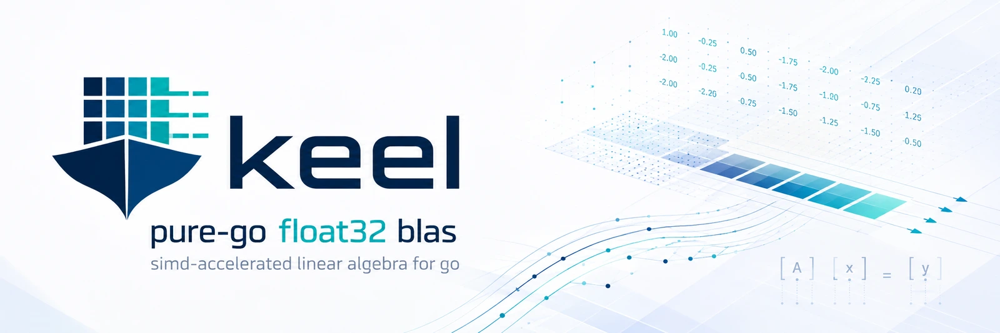

# keel

A pure-Go float32 BLAS subset built on Go's experimental SIMD support
(`GOEXPERIMENT=simd`, Go 1.26+). Kernels that inline, respect safepoints,
and parallelize on the caller's `GOMAXPROCS` — no cgo, no background
threads, deploys as a normal Go module.

**Status: pre-release.** Levels 1–3 are implemented and gated; P0–P4 are
green and P5 (parallelism, dispatch, polish) is in progress with its gate
written and red. Watch the [milestones](../../milestones) for progress.

## Measured rates

Every number keel publishes carries its denominator (DESIGN.md §7 rule 7):
the CPU model, the peak measured on that same host in that same run, and the
OpenBLAS reference where one was available. The table below is re-measured by
`scripts/gate-p5.sh` on each benchmark host and the gate fails on a 5%
disagreement, so a stale row cannot survive a gate run. Rows are keyed by CPU
model, never by hostname.

<!-- keel-numbers: begin -->
| CPU | benchmark | threads | GFLOP/s | denominator |
| --- | --- | --- | --- | --- |
| AMD Ryzen 9 7950X3D 16-Core Processor | Sgemm | 1 | 153 | 92.1% of 166.05 GFLOP/s, the 1-thread avx512 microkernel peak measured in the same run |
| AMD Ryzen 9 7950X3D 16-Core Processor | Sgemm | 8 | 890.9 | 67.1% of 1328.4 GFLOP/s, that same peak x 8 cores |
| AMD Ryzen 9 7950X3D 16-Core Processor | Ssyrk | 1 | 130.7 | 78.7% of 166.05 GFLOP/s, the 1-thread avx512 microkernel peak measured in the same run |
| AMD Ryzen 9 7950X3D 16-Core Processor | Ssyrk | 8 | 902.9 | 68.0% of 1328.4 GFLOP/s, that same peak x 8 cores |
| AMD Ryzen 9 7950X3D 16-Core Processor | Ssymm | 1 | 144.4 | 87.0% of 166.05 GFLOP/s, the 1-thread avx512 microkernel peak measured in the same run |
| AMD Ryzen 9 7950X3D 16-Core Processor | Ssymm | 8 | 826.2 | 62.2% of 1328.4 GFLOP/s, that same peak x 8 cores |
| AMD Ryzen 9 7950X3D 16-Core Processor | Strsm | 1 | 52.1 | 31.4% of 166.05 GFLOP/s, the 1-thread avx512 microkernel peak measured in the same run |
| AMD Ryzen 9 7950X3D 16-Core Processor | Strsm | 8 | 378.1 | 28.5% of 1328.4 GFLOP/s, that same peak x 8 cores |
| Intel(R) Core(TM) i9-9960X CPU @ 3.10GHz | Sgemm | 1 | 76.5 | 35.4% of 216.1 GFLOP/s, the 1-thread avx512 microkernel peak measured in the same run |
| Intel(R) Core(TM) i9-9960X CPU @ 3.10GHz | Sgemm | 8 | 495.2 | 28.6% of 1728.8 GFLOP/s, that same peak x 8 cores |
| Intel(R) Core(TM) i9-9960X CPU @ 3.10GHz | Ssyrk | 1 | 69.49 | 32.2% of 216.1 GFLOP/s, the 1-thread avx512 microkernel peak measured in the same run |
| Intel(R) Core(TM) i9-9960X CPU @ 3.10GHz | Ssyrk | 8 | 490.2 | 28.4% of 1728.8 GFLOP/s, that same peak x 8 cores |
| Intel(R) Core(TM) i9-9960X CPU @ 3.10GHz | Ssymm | 1 | 70.48 | 32.6% of 216.1 GFLOP/s, the 1-thread avx512 microkernel peak measured in the same run |
| Intel(R) Core(TM) i9-9960X CPU @ 3.10GHz | Ssymm | 8 | 463.7 | 26.8% of 1728.8 GFLOP/s, that same peak x 8 cores |
| Intel(R) Core(TM) i9-9960X CPU @ 3.10GHz | Strsm | 1 | 27.1 | 12.5% of 216.1 GFLOP/s, the 1-thread avx512 microkernel peak measured in the same run |
| Intel(R) Core(TM) i9-9960X CPU @ 3.10GHz | Strsm | 8 | 184.8 | 10.7% of 1728.8 GFLOP/s, that same peak x 8 cores |
| AMD RYZEN AI MAX+ 395 w/ Radeon 8060S | Sgemm | 1 | 194.8 | 59.4% of 327.8 GFLOP/s, the 1-thread avx512 microkernel peak measured in the same run |
| AMD RYZEN AI MAX+ 395 w/ Radeon 8060S | Sgemm | 8 | 1116 | 42.5% of 2622.4 GFLOP/s, that same peak x 8 cores |
| AMD RYZEN AI MAX+ 395 w/ Radeon 8060S | Ssyrk | 1 | 165.6 | 50.5% of 327.8 GFLOP/s, the 1-thread avx512 microkernel peak measured in the same run |
| AMD RYZEN AI MAX+ 395 w/ Radeon 8060S | Ssyrk | 8 | 1129 | 43.1% of 2622.4 GFLOP/s, that same peak x 8 cores |
| AMD RYZEN AI MAX+ 395 w/ Radeon 8060S | Ssymm | 1 | 182.3 | 55.6% of 327.8 GFLOP/s, the 1-thread avx512 microkernel peak measured in the same run |
| AMD RYZEN AI MAX+ 395 w/ Radeon 8060S | Ssymm | 8 | 980 | 37.4% of 2622.4 GFLOP/s, that same peak x 8 cores |
| AMD RYZEN AI MAX+ 395 w/ Radeon 8060S | Strsm | 1 | 60.02 | 18.3% of 327.8 GFLOP/s, the 1-thread avx512 microkernel peak measured in the same run |
| AMD RYZEN AI MAX+ 395 w/ Radeon 8060S | Strsm | 8 | 421.6 | 16.1% of 2622.4 GFLOP/s, that same peak x 8 cores |
<!-- keel-numbers: end -->

All 24 rows come from one run — `scripts/gate-p5.sh` at rev `083cbdb`, log in
`build/gate-p5-083cbdb.log` — at n=4096 square, `GOMAXPROCS` pinned to the
threads column, `performance` governor, hosts otherwise idle. The 1-thread and
8-thread rows for a routine are the two arms of that run's scaling ratio, so
they are directly comparable to each other; rows from different CPUs are not,
because the peaks differ.

**The denominator here is keel's own microkernel, not OpenBLAS.** No OpenBLAS
reference was taken at these thread counts, so the comparison DESIGN.md §7
rule 7 asks for is absent rather than unflattering, and the only bar these
rows are measured against is what keel's own AVX-512 microkernel achieved on
the same host in the same run. Read the percentages as "how much of its own
kernel does the blocked nest keep", not as a competitive result.

**Both denominators are measured on an idle machine, which cuts against the
8-thread column.** The 1-thread peak is taken with one core loaded, so it
includes a single-core boost clock the 8-thread arm does not get to keep;
multiplying it by 8 therefore asks the parallel nest to beat a clock it never
runs at. That is why the 8-thread percentages sit below the 1-thread ones on
every host, and it is also why the gate's own `>= 6.0x` scaling floor was
missed, in this same run at rev `083cbdb` on 2026-08-15, on the two hosts that
keep the *most* of their single-thread peak. Ruled 2026-08-17 (#66): the clock is
now measured rather than set, because the AWS fleet that replaced these three
desktops exposes no boost knob at all — so this handicap is disclosed rather than
removed, and these percentages stay a floor on the parallel nest's efficiency and
not an estimate of it.

## Why
Go has excellent float64 numerics (Gonum) and no maintained fast float32
story. The experimental `simd`/`archsimd` packages make preemption-safe
vector kernels possible for the first time; keel is a Goto/BLIS-style
SGEMM-centered BLAS subset built on them — and a field report on the
experiment (`docs/toolchain-notes.md`).

## Scope (v0)
Level 1 (`Sdot Saxpy Sscal Snrm2 Sasum Isamax`), Level 2 (`Sgemv Sger`),
Level 3 (`Sgemm` plus derived `Ssyrk Ssymm Strsm`). Row-major, float32,
amd64 fast paths (AVX-512/AVX2) with a scalar fallback that builds on a
stock toolchain. Target: ≥70% of single-threaded OpenBLAS SGEMM on AVX-512
hardware. Non-goals and rationale: `DESIGN.md` §1–2.

## Building
```
GOEXPERIMENT=simd go build ./...   # fast paths (Go 1.26+)
go build ./...                     # scalar-only, stock toolchain
make test                          # or: gate-p0 … gate-p5
```

## Project management
GitHub milestones = phases P0–P5 (DESIGN.md §4); each has an umbrella issue
with the task checklist and gate criteria. `scripts/bootstrap-github.sh`
creates the repo, labels, milestones, issues, and project board.

## License
Apache-2.0 — Copyright 2026 Scott Friedman. See `LICENSE` and `NOTICE`.
